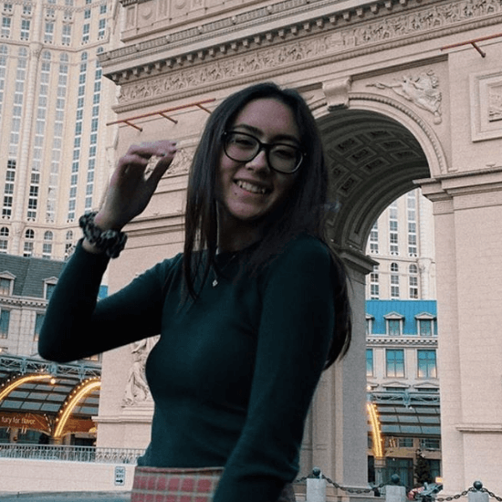
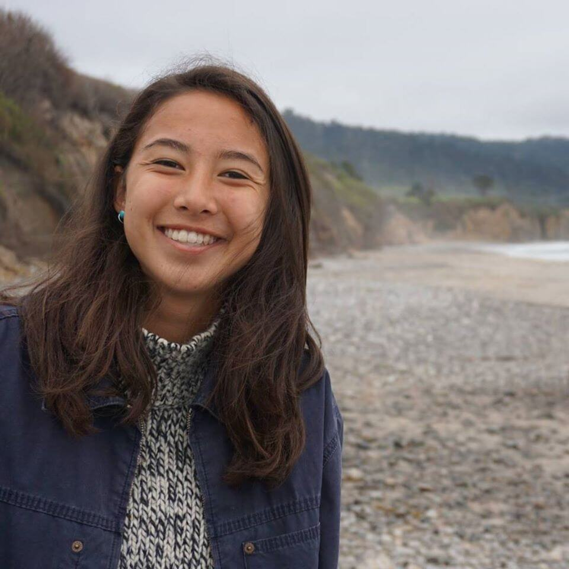
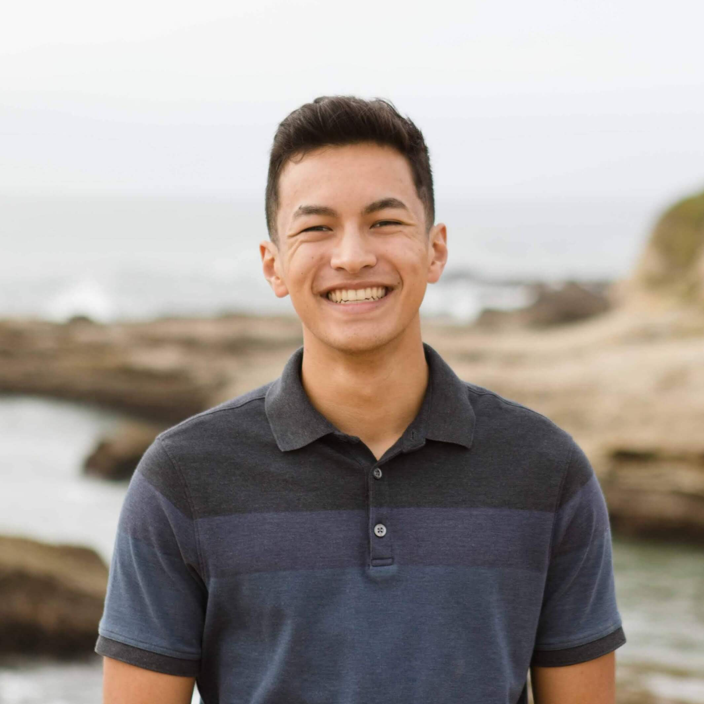
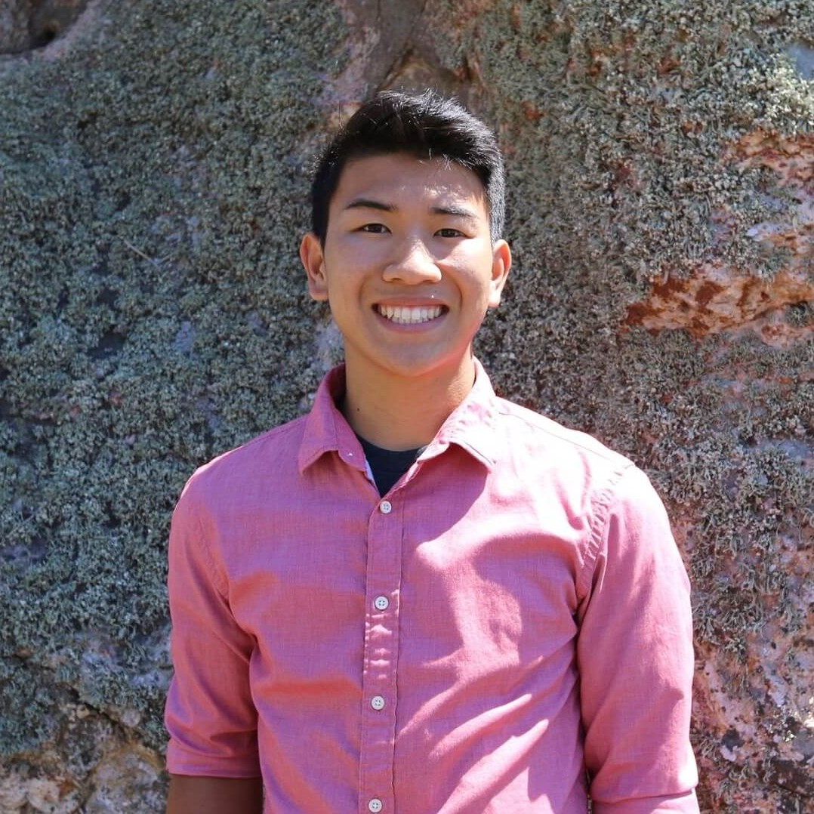
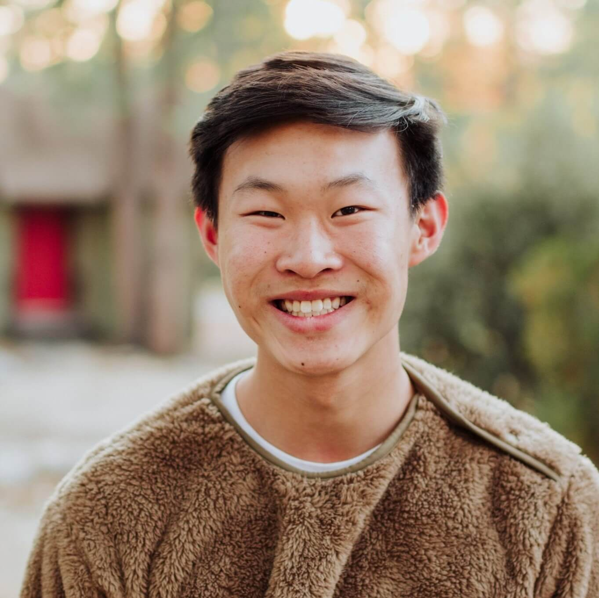
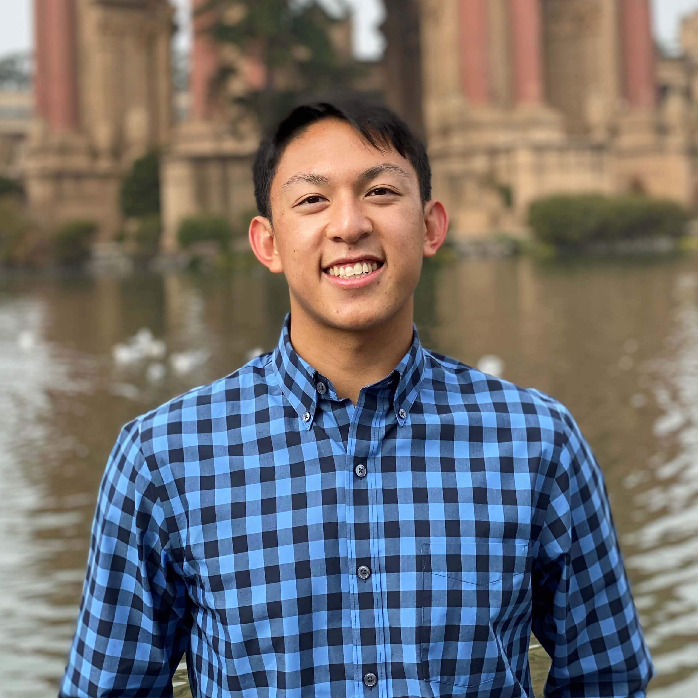

# The Wedding Party

## Bridesmaids

    

        
        

            <h3>Rachel Handran - <i>Maid of Honor</i></h3>
            
Hi! My name is Rachel, and I’m Rebekah’s sister. We’ve grown up together, and she’s always been my role model. There are so many countless memories we’ve made over the years, including our trips to San Francisco and Monterey. Fun fact: I fostered kittens and have 2 cats!

        

    

    

        
        

            <h3>Grace Khieu</h3>
            
I met Rebekah through Josiah when she came to Cal Poly, but after a couple of good conversations during her first fall quarter, we ended up hanging out every week and I eventually started discipling her. We would read and go through content together, but my favorite parts of discipleship were the times where we would just talk about our weeks and spill the tea! I really love cats because they are the perfect companion, and often find myself being like one—sleeping a lot and sometimes being a little sassy.

        

    

    

        
        

            <h3>Kenna Doeden</h3>
            
Rebekah was one of the first people that I met in Epic! I distinctly remember meeting her through a freshman community group gathering at YoCre, and we have since bonded over a shared love of veterinary medicine and animal science. Some of my favorite memories with Rebekah involve spontaneous late night cramming interspersed with thoughtful conversation and bouts of laughter. Fun fact: I have lived over 4 months of my life on a houseboat!

        

    

    

        
        

            <h3>Rachel Loh</h3>
            
I feel so blessed that I met Rebekah through our Christian fellowship, Epic!  One of my most cherished memories with her is actually when we had our first one on one.  We were sitting in 805 (the dining area) and we started to share our struggles and from that moment I knew she was going to be an amazing and genuine friend.  Since then, I have loved hanging with her, living with her, and knocking on her door to say hey!  Fun fact: my dog has more followers on <a href="https://www.instagram.com/jameystagram/" target="_blank">Instagram</a> than me.
            

        

    

## Groomsmen

    

        
        

            <h3>Kolson Frame - <i>Best Man</i></h3>
            
Hi there, I'm Kolson! I've had the privilege of meeting Josiah through my freshman small group at Cal Poly. To me, Josiah is a positive influence as a mentor, a brother in Christ, and ultimately a close friend. Some good memories I've had with him include spontaneous camping trips, birthdays celebrated, and most importantly the elaborate proposal plan for him and Rebekah back in September! When I'm not hanging out with Josiah, you can find me hammocking at Avila Beach, shooting some hoops on the basketball court, or belting out the lyrics of my favorite songs in the car.
            

        

    

    

        
        

            <h3>Kyle Chin</h3>
            
I met Josiah through Epic SLO his first year, but what brought us closer was the fact that we switched majors at the same time. I was only a year ahead of him, but I had done enough to want to save him from another year of boring hardware classes (sorry EEs). Eventually, I had the opportunity to disciple him and our friendship only grew stronger. One of my favorite memories is doing an escape room where Josiah took control and we barely escaped. I’m a big Star Wars and Marvel fan, but let’s be real, Iron Man’s snap was way cooler than Rey changing her last name to Skywalker… oops spoilers.  ¯\_(ツ)_/¯
            

        

    

    

        
        

            <h3>Ephraim Pang</h3>
            
As Josiah's younger brother I've known him for practically my whole life. Josiah has always been someone that I look up to and has been a great role model in my life. Much of our time spent together was growing up when we would play with our toys together, (nerf guns and pokemon cards) admittedly also some of my fondest memories with Josiah. Fun fact: I enjoy watching Gordon Ramsay and cooking shows.
            

        

    

    

        
        

            <h3>Russell Caletena</h3>
            
I first met Josiah through Robotics Club and IEEE during our freshman year at Cal Poly. He introduced me to Epic soon after and our friendship continued to grow where we bonded over deep conversations on life, hackathons, candle making, and a sausage-making class. I’ll always cherish the memory where Josiah and I ran the entire 2019 SLO Half Marathon by each other’s side showing me that this race we call life is meant to be endured together with good friends who can continuously challenge you along the way. Fun fact: <a href="https://photos.app.goo.gl/5zZhmf3uq9f5jhmY7" target="_blank">Josiah and I met Phil from Wong Fu Productions at the soft opening of his Bopomofo Cafe last year.</a>
            

        

    

