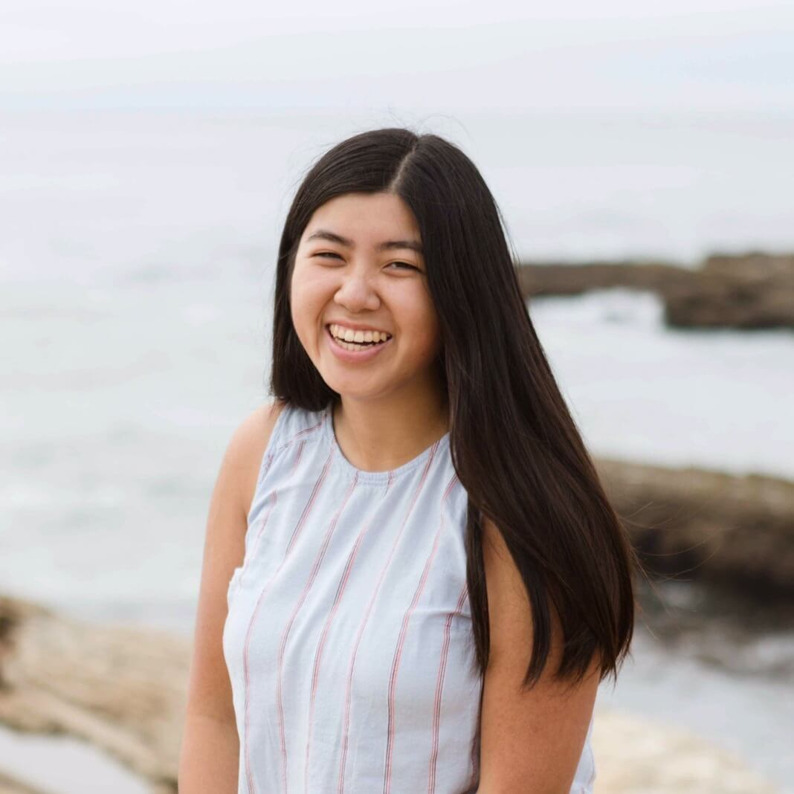

# The Wedding Party

## Bridesmaids

    

        
        

            <h3>Grace Khieu</h3>
            
I met Rebekah through Josiah when she came to Cal Poly, but after a couple of good conversations during her first fall quarter, we ended up hanging out every week and I eventually started discipling her. We would read and go through content together, but my favorite parts of discipleship were the times where we would just talk about our weeks and spill the tea! I really love cats because they are the perfect companion, and often find myself being like one—sleeping a lot and sometimes being a little sassy.

        

    

    

        
        

            <h3>Rachel Loh</h3>
            
I feel so blessed that I met Rebekah through our Christian fellowship, Epic!  One of my most cherished memories with her is actually when we had our first one on one.  We were sitting in 805 (the dining area) and we started to share our struggles and from that moment I knew she was going to be an amazing and genuine friend.  Since then, I have loved hanging with her, living with her, and knocking on her door to say hey!  Fun fact: my dog has more followers on instagram than me.
            

        

    

## Groomsmen

